# FleetPulse Azure Container Apps Infrastructure

This repository contains production-grade infrastructure code to migrate FleetPulse from Docker Compose to Azure Container Apps (ACA) with private networking, Site-to-Site VPN connectivity, and comprehensive security controls.

## 🏗️ Architecture Overview

## 🏗️ Architecture Overview

### High-Level Architecture


### Network Topology & Traffic Flow

```mermaid
graph TB
    subgraph OnPremises["🏢 On-premises Network"]
        HomeNet[Home Network<br/>192.168.1.0/24]
        OPN[OPNsense Router<br/>Public IP]
    end
    
    subgraph Azure["☁️ Azure West Europe"]
        PIP[📡 Public IP<br/>VPN Gateway]
        
        subgraph RG["📋 Resource Group: rg-fleetpulse-prod"]
            subgraph VNET["🌐 vnet-fleetpulse-prod (10.20.0.0/24)"]
                
                subgraph ACASub["📦 snet-aca-infra (10.20.0.0/27)"]
                    ACAENV[🚀 Container Apps Environment<br/>Internal Load Balancer Only]
                    
                    subgraph Apps["Applications"]
                        BE[⚙️ Backend<br/>backend.backelant.eu:8000]
                        FE[🖥️ Frontend<br/>frontend.backelant.eu:443]
                        OT[📊 OTEL Collector<br/>:4317]
                    end
                end
                
                subgraph GWSub["🚪 GatewaySubnet (10.20.0.32/27)"]
                    VPNGW[🔒 VPN Gateway<br/>VpnGw1 SKU]
                end
                
                subgraph PLSub["🔗 snet-privatelink (10.20.0.64/27)"]
                    KVPE[🔐 Key Vault PE]
                    STPE[💾 Storage PE]
                    AIPE[📈 App Insights PE]
                end
                
                subgraph DNSSub["🌍 snet-dnsresolver-inbound (10.20.0.128/27)"]
                    DNSRES[🌍 DNS Private Resolver<br/>Conditional Forwarding]
                end
            end
        end
    end
    
    %% Traffic Flows
    HomeNet -.->|Internet Access| OPN
    OPN -.->|IPsec Tunnel BGP 65010| PIP
    PIP --> VPNGW
    VPNGW -.->|Route 10.20.0.0/24| VNET
    
    ACAENV -.->|Internal Traffic| BE
    ACAENV -.->|Internal Traffic| FE
    BE -.->|Telemetry| OT
    
    BE -.->|Private DNS| KVPE
    BE -.->|Private DNS| STPE
    BE -.->|Private DNS| AIPE
    
    HomeNet -.->|DNS Queries| DNSRES
    DNSRES -.->|Conditional Forward| BE
    
    %% Security Boundaries
    subgraph Security["🔒 Security Features"]
        direction LR
        NSG[🛡️ Network Security Groups]
        PE[🔗 Private Endpoints Only]
        VPN[🔒 VPN-Only Access]
        TLS[🔐 TLS/mTLS Encryption]
    end
    
    %% Styling
    classDef onprem fill:#ff6b35,stroke:#ffffff,stroke-width:2px,color:#ffffff
    classDef azure fill:#0078d4,stroke:#ffffff,stroke-width:2px,color:#ffffff
    classDef network fill:#00bcf2,stroke:#ffffff,stroke-width:2px,color:#ffffff
    classDef apps fill:#7fba00,stroke:#ffffff,stroke-width:2px,color:#ffffff
    classDef security fill:#e74c3c,stroke:#ffffff,stroke-width:2px,color:#ffffff
    
    class OnPremises,HomeNet,OPN onprem
    class Azure,RG azure
    class VNET,GWSub,ACASub,PLSub,DNSSub network
    class BE,FE,OT,ACAENV apps
    class Security,NSG,PE,VPN,TLS security
```



### 🔧 Network Configuration Details


### 🔒 Security & Access Control

| Component | Access Method | Source Networks | Ports | Protocol |
|-----------|---------------|-----------------|--------|----------|
| **Frontend** | Internal LB only | VPN networks | 443 | HTTPS |
| **Backend API** | Internal LB only | VPN networks | 8000 | HTTPS |
| **OTEL Collector** | Internal only | Container Apps | 4317, 4318 | gRPC/HTTP |
| **Key Vault** | Private Endpoint | Container Apps | 443 | HTTPS |
| **Azure Files** | Private Endpoint | Container Apps | 445 | SMB 3.0 |
| **App Insights** | Private Endpoint | Container Apps | 443 | HTTPS |

### 📊 Traffic Flow Summary

1. **Inbound**: On-premises → VPN → Internal Load Balancer → Container Apps
2. **Service-to-Service**: Apps → Private Endpoints (Key Vault, Storage, Monitoring)
3. **DNS**: On-premises DNS → Conditional forwarding → Azure DNS Resolver → Internal resolution
4. **Outbound**: Container Apps → Azure services via private endpoints (no internet egress)

### 🧩 Terraform Module Dependencies

```mermaid
graph TB
    subgraph Core["🏗️ Core Infrastructure"]
        RG[📋 Resource Group<br/>rg-fleetpulse-prod]
        VNET[🌐 VNet Module<br/>Network Foundation]
    end
    
    subgraph Network["🌐 Networking Modules"]
        GW[🚪 Gateway Module<br/>VPN Site-to-Site]
        DNS[🌍 DNS Resolver<br/>Conditional Forwarding]
        FW[🔥 Firewall Module<br/>⚠️ Currently Disabled]
    end
    
    subgraph Security["🔒 Security & Storage"]
        KV[🔐 KeyVault Module<br/>Secrets & Certificates]
        ST[💾 Storage Module<br/>Azure Files]
        POL[📜 Policy Module<br/>Security Policies]
    end
    
    subgraph Platform["🚀 Platform Services"]
        MON[📈 Monitor Module<br/>App Insights + AMPLS]
        ENV[📦 ACA Environment<br/>Container Platform]
    end
    
    subgraph Applications["⚙️ Applications"]
        APPS[🚀 Apps Module<br/>Backend + Frontend + OTEL]
    end
    
    %% Dependencies Flow
    RG --> VNET
    VNET --> GW
    VNET --> DNS
    VNET --> KV
    VNET --> ST
    VNET --> MON
    VNET --> ENV
    
    GW -.->|VPN Connectivity| ENV
    KV --> MON
    MON --> ENV
    ENV --> APPS
    
    KV -.->|Secrets| APPS
    ST -.->|Persistent Storage| APPS
    MON -.->|Telemetry| APPS
    DNS -.->|Name Resolution| APPS
    
    POL -.->|Governance| ENV
    FW -.->|Future Enhancement| ENV
    
    %% Styling
    classDef core fill:#1976d2,stroke:#ffffff,stroke-width:3px,color:#ffffff
    classDef network fill:#0288d1,stroke:#ffffff,stroke-width:2px,color:#ffffff
    classDef security fill:#7b1fa2,stroke:#ffffff,stroke-width:2px,color:#ffffff
    classDef platform fill:#388e3c,stroke:#ffffff,stroke-width:2px,color:#ffffff
    classDef apps fill:#f57c00,stroke:#ffffff,stroke-width:2px,color:#ffffff
    classDef disabled fill:#9e9e9e,stroke:#ffffff,stroke-width:2px,color:#ffffff
    
    class RG,VNET core
    class GW,DNS network
    class KV,ST,POL security
    class MON,ENV platform
    class APPS apps
    class FW disabled
```



## 🚀 Quick Start

### Prerequisites

1. **Azure CLI** installed and configured
2. **Terraform** >= 1.6.0
3. **Docker** (for image building)
4. **Azure subscription** with Contributor access
5. **OPNsense router** with public IP
6. **Technitium DNS** server on-premises
7. **SSL certificate** for `*.backelant.eu`

### 1. Setup Azure Authentication (OIDC)

Create a service principal with OIDC federation for GitHub Actions:

```bash
# Create service principal
az ad sp create-for-rbac --name "fleetpulse-github-actions" \
  --role "Contributor" \
  --scopes "/subscriptions/YOUR_SUBSCRIPTION_ID"

# Configure OIDC federation
az ad app federated-credential create \
  --id YOUR_APP_ID \
  --parameters @oidc-credential.json
```

Set these GitHub repository secrets:
- `AZURE_CLIENT_ID`
- `AZURE_TENANT_ID`
- `AZURE_SUBSCRIPTION_ID`
- `DOCKERHUB_USERNAME`
- `DOCKERHUB_TOKEN`
- Additional CI / GitHub Actions secrets (do NOT commit these to the repo):
  - `TF_VPN_SHARED_KEY` — VPN pre-shared key (sensitive)
  - `TF_ON_PREM_GATEWAY_IP` — Public IP of your on-prem OPNsense gateway (sensitive)

### 2. Configure Terraform Variables

```bash
cd infra/terraform/envs/prod
cp terraform.tfvars.example terraform.tfvars
```

Update `terraform.tfvars` with your actual values:

| Variable | Description | Example |
|----------|-------------|---------|
| `on_premises_gateway_ip` | OPNsense public IP | `203.0.113.1` |
| `on_premises_networks` | On-prem network CIDRs | `["192.168.0.0/24"]` |
| `home_cidrs` | Trusted network CIDRs | `["192.168.0.0/24"]` |
| `vpn_shared_key` | Strong PSK for VPN | `your-strong-psk-here` |
| `custom_domains` | Your domain names | See example file |

Important security notes
- Do NOT commit real secrets (PSKs, private IPs, certificates) into the repo. The workflow is configured to accept sensitive values via GitHub Actions Secrets (see list above) and will inject them as `TF_VAR_*` at runtime so Terraform receives them without a checked-in `terraform.tfvars` containing secrets.
- `container_images` are not treated as secrets — keep image names/tags in `terraform.tfvars` or override them via non-secret workflow inputs. Pin image tags for production.

CI / GitHub Actions

- The repository includes a `terraform-deploy` workflow that authenticates to Azure using OIDC and deploys the `prod` environment.
- Workflow inputs (available when running the workflow manually via Actions → Terraform Deploy → Run workflow):
  - `region` — optional; overrides the `location` Terraform variable for the run (sets `TF_VAR_location`).
  - `custom_domains` — optional JSON string; overrides `custom_domains` (sets `TF_VAR_custom_domains`). Example value:

  {"backend":"backend.example.com","frontend":"frontend.example.com","wildcard":"*.example.com"}

- Recommended setup for production:
  - Add `TF_VPN_SHARED_KEY` and `TF_ON_PREM_GATEWAY_IP` as environment-level secrets for the `production` environment in GitHub (not repo-level) and protect the environment with required approvers if appropriate.
  - Do not echo secrets or commit them. The workflow validates required secrets before running Terraform and fails early if missing.

How the workflow consumes values
- Secrets such as `TF_VPN_SHARED_KEY` and `TF_ON_PREM_GATEWAY_IP` are passed into Terraform via `TF_VAR_*` environment variables so Terraform variables marked sensitive are supplied at runtime.
- Non-secret overrides (region/custom_domains) can be provided using the workflow_dispatch inputs in the Actions UI; they are exported as `TF_VAR_location` and `TF_VAR_custom_domains` for the run.

### 3. Deploy Infrastructure

```bash
# Initialize Terraform
terraform init

# Plan deployment
terraform plan -var-file="terraform.tfvars"

# Apply (or use GitHub Actions)
terraform apply -var-file="terraform.tfvars"
```

### 3.1 Secret & Connection String Management Strategy

By design this deployment does NOT create Key Vault secrets during the first apply. Two module toggles control this:

| Module | Variable | Default | Purpose |
|--------|----------|---------|---------|
| `keyvault` | `manage_placeholder_secrets` | `false` | Would create placeholder `ssl-cert-pfx` & `ssl-cert-password` secrets (kept off to avoid storing sensitive data in state) |
| `monitor` | `store_app_insights_connection_string` | `false` | Would persist the App Insights connection string as a secret (apps can alternatively set it via config) |

Why keep them `false` initially?
- Avoids Key Vault data-plane calls while Terraform is running from outside the private network (no 403 errors)
- Prevents secret values (even placeholders) from entering Terraform state
- Encourages principle: Terraform manages infrastructure, pipelines manage secret data

When to enable later (optional):
- Only if you explicitly want Terraform to track the existence of those secrets. You would then re-run `terraform apply` from inside the VNet (self‑hosted runner / jump box) after flipping to `true`.

Recommended approach: leave both `false` permanently and inject real secrets externally (next section).

### 3.2 Injecting Secrets Externally (Recommended)

After the first successful apply, create/import secrets using a process that runs inside the VNet or over the private connection.

1. Provision a secure execution environment inside the VNet (options):
     - Self-hosted GitHub Actions runner VM with a System Assigned or User Assigned Managed Identity
     - Azure Container Instance or Container App job with Managed Identity
     - Admin workstation connected via the Site-to-Site VPN
2. Grant the identity appropriate RBAC on the Key Vault:
     - For secrets only: `Key Vault Secrets Officer` (or a custom role with get/set/list)
     - For certificate import: also `Key Vault Certificates Officer`
3. Use Azure CLI to set/import secrets (examples below)

Raw secret (PFX as base64 if large/binary):
```bash
base64 -w0 cert.pfx > cert.pfx.b64
az keyvault secret set --vault-name <your_kv_name> \
    --name ssl-cert-pfx --file cert.pfx.b64 --encoding base64

az keyvault secret set --vault-name <your_kv_name> \
    --name ssl-cert-password --value "$PFX_PASSWORD"
```

Certificate import (preferred – enables lifecycle features):
```bash
az keyvault certificate import --vault-name <your_kv_name> \
    --name ssl-tls-cert --file cert.pfx --password "$PFX_PASSWORD"
```

Application Insights connection string (optional if not injected via env):
```bash
APPINSIGHTS_CS=$(az monitor app-insights component show \
    --app <app_insights_name> \
    --resource-group <resource_group> \
    --query connectionString -o tsv)
az keyvault secret set --vault-name <your_kv_name> \
    --name app-insights-connection-string --value "$APPINSIGHTS_CS"
```

### 3.3 GitHub Actions Secret Injection (Example)

Example job using a self-hosted runner inside the VNet and OIDC auth (identity must have proper Key Vault RBAC):
```yaml
jobs:
    inject-secrets:
        runs-on: self-hosted
        permissions:
            id-token: write
            contents: read
        steps:
            - name: Azure Login
                uses: azure/login@v2
                with:
                    client-id: ${{ secrets.AZURE_CLIENT_ID }}
                    tenant-id: ${{ secrets.AZURE_TENANT_ID }}
                    subscription-id: ${{ secrets.AZURE_SUBSCRIPTION_ID }}

            - name: Import TLS Certificate
                env:
                    PFX_PASSWORD: ${{ secrets.PFX_PASSWORD }}
                run: |
                    az keyvault certificate import \
                        --vault-name $KV_NAME \
                        --name ssl-tls-cert \
                        --file cert.pfx \
                        --password "$PFX_PASSWORD"

            - name: Store App Insights Connection String
                if: ${{ env.STORE_AI_CS == 'true' }}
                run: |
                    CS=$(az monitor app-insights component show \
                        --app $AI_NAME \
                        --resource-group $RG \
                        --query connectionString -o tsv)
                    az keyvault secret set --vault-name $KV_NAME \
                        --name app-insights-connection-string --value "$CS"
```

Environment variables (via workflow or env block): `KV_NAME`, `AI_NAME`, `RG`, optional `STORE_AI_CS=true`.

Rotation: rerun the job with updated PFX / password; Key Vault versions the secret/certificate automatically.

### 3.4 (Optional) Enabling Terraform Management Later

1. Ensure you can run Terraform from inside the VNet (self‑hosted runner).
2. Set in `envs/prod/main.tf`:
     ```hcl
     manage_placeholder_secrets = true
     store_app_insights_connection_string = true
     ```
3. `terraform plan` — expect additions of the secret resources.
4. `terraform apply` — placeholder secrets (and connection string) appear in state.

Note: Avoid storing real certificate password in Terraform variables/state; keep placeholders only or continue external management.

### 4. Configure DNS and VPN

After deployment, configure:

1. **OPNsense VPN**: See [docs/opnsense-ipsec.md](docs/opnsense-ipsec.md)
2. **Technitium DNS**: See [docs/technitium-dns.md](docs/technitium-dns.md)
3. **SSL Certificates**: Upload to Key Vault and run post-deploy script

### 5. Validation

```bash
# Test VPN connectivity
ping 10.20.0.4  # ACA environment IP

# Test DNS resolution
nslookup backend.backelant.eu

# Test HTTPS endpoints
curl -k https://backend.backelant.eu:8000/health
curl -k https://frontend.backelant.eu
```

## 📁 Repository Structure

```
├── infra/terraform/
│   ├── envs/prod/              # Production environment
│   │   ├── main.tf             # Root module
│   │   ├── variables.tf        # Variable definitions
│   │   ├── outputs.tf          # Outputs
│   │   └── terraform.tfvars.example
│   └── modules/                # Reusable modules
│       ├── vnet/               # Virtual network
│       ├── gateway/            # VPN gateway
│       ├── firewall/           # Azure Firewall (unused - for future expansion)
│       ├── dns_resolver/       # DNS Private Resolver
│       ├── storage/            # Azure Files
│       ├── keyvault/           # Key Vault
│       ├── monitor/            # App Insights + AMPLS
│       ├── policy/             # Azure Policy
│       ├── aca_env/            # Container Apps Environment
│       └── apps/               # Container Apps
├── .github/workflows/          # CI/CD pipelines
├── docs/                       # Documentation
├── README.md                   # This file
├── SECURITY.md                 # Security policy
└── CODEOWNERS                  # Code ownership
```

## 🔐 Security Model

### Network Security
- **Private Container Apps** with internal load balancer only
- **Private networking** with no public endpoints
- **IP restrictions** limit access to trusted networks  
- **Site-to-Site VPN** provides secure connectivity

### Identity & Access
- **Managed Identity** for all Azure service authentication
- **RBAC** controls access to Key Vault and resources
- **OIDC federation** eliminates stored secrets in CI/CD

### Data Protection
- **Private Endpoints** for all Azure services
- **Key Vault** stores all secrets and certificates
- **Azure Files** with private connectivity
- **TLS 1.2+** enforced everywhere

### Monitoring & Compliance
- **Azure Policy** enforces security requirements
- **Application Insights** with private telemetry
- **Azure Monitor Private Link Scope** (AMPLS)
- **Security scanning** in CI/CD pipeline

## 🔧 Operational Procedures

### Certificate Management

1. **Recommended (certificate import)**:
     ```bash
     az keyvault certificate import --vault-name YOUR_KV_NAME \
         --name ssl-tls-cert --file certificate.pfx --password "cert-password"
     ```

2. **Alternative (raw secrets)**:
     ```bash
     base64 -w0 certificate.pfx > certificate.pfx.b64
     az keyvault secret set --vault-name YOUR_KV_NAME \
         --name ssl-cert-pfx --file certificate.pfx.b64 --encoding base64
     az keyvault secret set --vault-name YOUR_KV_NAME \
         --name ssl-cert-password --value "cert-password"
     ```

3. **App Insights connection string (optional)**:
     ```bash
     APPINSIGHTS_CS=$(az monitor app-insights component show \
         --app YOUR_AI_NAME \
         --resource-group YOUR_RG \
         --query connectionString -o tsv)
     az keyvault secret set --vault-name YOUR_KV_NAME \
         --name app-insights-connection-string --value "$APPINSIGHTS_CS"
     ```

### Scaling Applications

```bash
# Scale backend
az containerapp update --name fleetpulse-prod-backend \
  --resource-group rg-fleetpulse-prod \
  --min-replicas 2 --max-replicas 10

# Scale frontend
az containerapp update --name fleetpulse-prod-frontend \
  --resource-group rg-fleetpulse-prod \
  --min-replicas 2 --max-replicas 5
```

### Data Migration

Migrate data from on-premises to Azure Files:

```bash
# Mount Azure Files share locally (from on-premises)
sudo mkdir -p /mnt/azure-files
sudo mount -t cifs //STORAGE_ACCOUNT.file.core.windows.net/fleetpulse \
  /mnt/azure-files -o username=STORAGE_ACCOUNT,password=STORAGE_KEY

# Copy data
rsync -av /mnt/data/dockervolumes/fleetpulse/ /mnt/azure-files/
```

### Disaster Recovery

1. **Backup**: Azure Files has built-in redundancy and soft delete
2. **Infrastructure**: Terraform state enables infrastructure recreation
3. **Configuration**: All configuration is in code (GitOps)

## 💰 Cost Optimization

Estimated monthly costs (West Europe):

| Service | Configuration | Est. Cost |
|---------|---------------|-----------|
| Container Apps | 3 apps, avg load | €50-100 |
| VPN Gateway | VpnGw1 | €25 |
| Storage | 100GB Files | €5 |
| Key Vault | Standard | €5 |
| App Insights | 1GB/month | €10 |
| **Total** | | **€95-145** |

> **Note**: Azure Firewall (€100/month) was removed for cost optimization. For larger deployments or stricter security requirements, consider adding Azure Firewall for egress traffic control.

Cost optimization tips:
- Use Consumption workload profile for variable loads
- Scale down non-production hours
- Monitor with cost alerts
- Consider Azure Firewall for expanded scope

## 🛠️ Development Workflow

1. **Feature branches**: Create feature branches for changes
2. **Pull requests**: All changes via PR with review
3. **CI/CD**: Automated testing and deployment
4. **Infrastructure changes**: Terraform plan on PR, apply on merge
5. **Security scanning**: Automated vulnerability scanning

## 📚 Additional Documentation

- [Technical Deep Dive](docs/blog.md)
- [OPNsense Configuration](docs/opnsense-ipsec.md)
- [Technitium DNS Setup](docs/technitium-dns.md)
- [Validation Checklist](docs/validation-checklist.md)

## 🆘 Troubleshooting

### Common Issues

**VPN not connecting:**
- Verify shared key matches on both sides
- Check firewall rules on OPNsense
- Validate IP addresses and subnets

**DNS not resolving:**
- Confirm conditional forwarders are configured
- Test DNS resolver endpoint connectivity
- Check private DNS zone linkage

**Container Apps not starting:**
- Review Container App logs: `az containerapp logs show`
- Verify managed identity permissions
- Check Key Vault access and secrets

**Storage mount fails:**
- Verify storage account key in ACA environment
- Check private endpoint connectivity
- Validate Azure Files share permissions

### Support

For issues:
1. Check [validation checklist](docs/validation-checklist.md)
2. Review Azure Activity Log
3. Open GitHub issue with logs and configuration

## 📄 License

This project is licensed under the MIT License - see the [LICENSE](LICENSE) file for details.

## 👥 Contributing

See [CODEOWNERS](CODEOWNERS) for code ownership and review requirements.

Security issues should be reported according to [SECURITY.md](SECURITY.md).