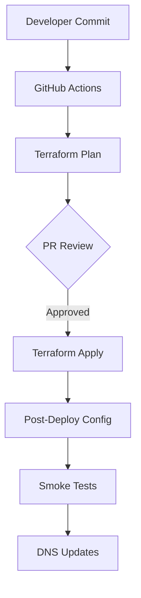

# FleetPulse Migration to Azure Container Apps: A Technical Deep Dive

*A comprehensive guide to migrating a Docker Compose workload to Azure Container Apps with enterprise-grade security and private networking.*

## Executive Summary

This document details the architectural decisions, implementation patterns, and migration strategy for moving FleetPulse from an on-premises Docker Compose deployment to Azure Container Apps (ACA) with private networking, Site-to-Site VPN connectivity, and comprehensive security controls.

The solution provides:
- **Zero public exposure** of applications
- **Private connectivity** via Site-to-Site VPN
- **Enterprise security** with Azure Policy and private endpoints
- **Modern observability** with OpenTelemetry and Azure Monitor
- **GitOps deployment** with infrastructure as code

## Migration Drivers

### Current State Challenges
- **Single point of failure** with on-premises Docker host
- **Manual scaling** and limited observability
- **Basic monitoring** with self-hosted Jaeger
- **Security gaps** in container and network isolation
- **Operational overhead** for maintenance and updates

### Target State Benefits
- **High availability** with Azure Container Apps
- **Automatic scaling** based on demand
- **Enterprise monitoring** with Azure Application Insights
- **Defense in depth** security model
- **Reduced operational burden** with managed services

## Architecture Decisions

### Why Azure Container Apps vs. AKS?

| Criteria | ACA | AKS | Decision |
|----------|-----|-----|----------|
| **Operational Overhead** | Low (serverless) | High (cluster mgmt) | ✅ ACA |
| **Scaling** | Built-in KEDA | Manual setup | ✅ ACA |
| **Cost** | Pay-per-use | Always-on nodes | ✅ ACA |
| **Compliance** | Built-in policies | Custom implementation | ✅ ACA |
| **Networking** | Simplified | Full control | ✅ ACA (sufficient) |

**Decision**: Azure Container Apps provides the right balance of simplicity and capabilities for FleetPulse's requirements.

### Network Architecture Deep Dive

```
┌─────────────────────────────────────────────────────────────────┐
│                    On-Premises Network                          │
│  192.168.0.0/24                                               │
│                                                                │
│  ┌─────────────┐    ┌──────────────┐    ┌─────────────────┐    │
│  │ Technitium  │    │   OPNsense   │    │   FleetPulse    │    │
│  │ DNS Server  │    │   Firewall   │    │   (Legacy)      │    │
│  │             │    │              │    │                 │    │
│  └─────────────┘    └──────┬───────┘    └─────────────────┘    │
└─────────────────────────────┼─────────────────────────────────────┘
                              │ Site-to-Site VPN
                              │ (IKEv2, AES-256, SHA-256)
                              │
┌─────────────────────────────┼─────────────────────────────────────┐
│                    Azure VNET (10.20.0.0/24)                   │
│                             │                                   │
│  ┌──────────────────────────┼─────────────────────────┐         │
│  │              VPN Gateway Subnet                    │         │
│  │              (10.20.0.32/27)                      │         │
│  │  ┌─────────────────────────────────────────────┐  │         │
│  │  │        Azure VPN Gateway                    │  │         │
│  │  │        (VpnGw1 SKU)                        │  │         │
│  │  └─────────────────────────────────────────────┘  │         │
│  └────────────────────────────────────────────────────┘         │
│                                                                │
│  ┌──────────────────────────────────────────────────────────┐   │
│  │           Azure Firewall Subnet                         │   │
│  │           (10.20.0.96/27)                              │   │
│  │  ┌─────────────────────────────────────────────────┐    │   │
│  │  │            Azure Firewall                      │    │   │
│  │  │            (Standard SKU)                      │    │   │
│  │  │                                               │    │   │
│  │  │  • Allow Docker Hub                          │    │   │
│  │  │  • Allow Azure Services                      │    │   │
│  │  │  • Block everything else                     │    │   │
│  │  └─────────────────────────────────────────────────┘    │   │
│  └──────────────────────────────────────────────────────────┘   │
│                             │                                   │
│                             │ User Defined Route                │
│                             ▼                                   │
│  ┌──────────────────────────────────────────────────────────┐   │
│  │        Container Apps Infrastructure Subnet             │   │
│  │        (10.20.0.0/27)                                  │   │
│  │                                                        │   │
│  │  ┌─────────────────────────────────────────────────┐    │   │
│  │  │      Container Apps Environment                 │    │   │
│  │  │      (Internal Load Balancer)                  │    │   │
│  │  │                                               │    │   │
│  │  │  ┌─────────┐ ┌─────────┐ ┌─────────────────┐  │    │   │
│  │  │  │Backend  │ │Frontend │ │ OpenTelemetry  │  │    │   │
│  │  │  │Container│ │Container│ │   Collector    │  │    │   │
│  │  │  │   App   │ │   App   │ │                │  │    │   │
│  │  │  └─────────┘ └─────────┘ └─────────────────┘  │    │   │
│  │  └─────────────────────────────────────────────────┘    │   │
│  └──────────────────────────────────────────────────────────┘   │
│                                                                │
│  ┌──────────────────────────────────────────────────────────┐   │
│  │         Private Link Subnet                             │   │
│  │         (10.20.0.64/27)                                │   │
│  │                                                        │   │
│  │  ┌─────────────┐ ┌─────────────┐ ┌─────────────────┐    │   │
│  │  │Key Vault PE │ │Storage PE   │ │App Insights PE │    │   │
│  │  │             │ │             │ │     (AMPLS)    │    │   │
│  │  └─────────────┘ └─────────────┘ └─────────────────┘    │   │
│  └──────────────────────────────────────────────────────────┘   │
│                                                                │
│  ┌──────────────────────────────────────────────────────────┐   │
│  │       DNS Private Resolver Inbound Subnet               │   │
│  │       (10.20.0.128/27)                                 │   │
│  │                                                        │   │
│  │  ┌─────────────────────────────────────────────────┐    │   │
│  │  │        DNS Private Resolver                     │    │   │
│  │  │        (Inbound Endpoint)                      │    │   │
│  │  │                                               │    │   │
│  │  │  Resolves privatelink.* domains              │    │   │
│  │  │  for on-premises clients                     │    │   │
│  │  └─────────────────────────────────────────────────┘    │   │
│  └──────────────────────────────────────────────────────────┘   │
└─────────────────────────────────────────────────────────────────┘
```

### Security Architecture

#### Defense in Depth Strategy

1. **Network Layer**
   - Private Container Apps (no public endpoints)
   - Azure Firewall with allow-list rules
   - VPN-only connectivity from on-premises
   - Network Security Groups and UDRs

2. **Identity Layer**
   - Managed Identity for all service-to-service auth
   - RBAC for human access
   - OIDC federation for CI/CD (no stored secrets)

3. **Application Layer**
   - Container image scanning with Trivy
   - Image signing with Cosign (optional)
   - IP restrictions on ingress controllers
   - TLS everywhere with private certificates

4. **Data Layer**
   - Private endpoints for all data services
   - Azure Files with SMB 3.0 encryption
   - Key Vault for secrets management
   - Application Insights with AMPLS

#### Azure Policy Enforcement

```hcl
# Built-in policy applied at Resource Group scope
resource "azurerm_resource_group_policy_assignment" "container_apps_no_external" {
  name                 = "deny-container-apps-external-access"
  resource_group_id    = var.resource_group_id
  policy_definition_id = data.azurerm_policy_definition.container_apps_external_network.id
  display_name         = "Deny Container Apps External Network Access"
  enforce              = true
}
```

This policy prevents any Container App from being configured with external network access, ensuring compliance with the private-only requirement.

## Migration Strategy

### Phase 1: Infrastructure Preparation

1. **Network Setup**
   - Deploy VNET with proper subnetting
   - Configure VPN Gateway and establish S2S connection
   - Set up Azure Firewall with initial rules
   - Deploy DNS Private Resolver

2. **Security Foundation**
   - Create Key Vault with private endpoint
   - Configure managed identities and RBAC
   - Set up Application Insights with AMPLS
   - Deploy policy assignments

### Phase 2: Data Migration

```bash
# 1. Create Azure Files share
az storage share create --name fleetpulse --account-name STORAGE_ACCOUNT

# 2. Mount share on-premises (via VPN)
sudo mount -t cifs //STORAGE_ACCOUNT.file.core.windows.net/fleetpulse \
  /mnt/azure-files -o username=STORAGE_ACCOUNT,password=KEY

# 3. Sync data with rsync
rsync -av --progress /mnt/data/dockervolumes/fleetpulse/ /mnt/azure-files/

# 4. Verify data integrity
find /mnt/data/dockervolumes/fleetpulse -type f -exec md5sum {} \; > /tmp/source.md5
find /mnt/azure-files -type f -exec md5sum {} \; > /tmp/dest.md5
diff /tmp/source.md5 /tmp/dest.md5
```

### Phase 3: Application Deployment

1. **Container Apps Environment**
   - Deploy with internal load balancer
   - Configure workload profiles for UDR support
   - Set up private DNS zones

2. **Application Deployment**
   - Deploy OpenTelemetry Collector
   - Deploy backend with Azure Files mount
   - Deploy frontend
   - Configure health probes and scaling

### Phase 4: Traffic Cutover

1. **DNS Updates**
   - Update Technitium DNS with new A records
   - Point backend.backelant.eu and frontend.backelant.eu to ACA ILB IP
   - Configure conditional forwarders for privatelink domains

2. **SSL Certificate Migration**
   - Upload wildcard certificate to Key Vault
   - Bind custom domains to Container Apps
   - Verify HTTPS functionality

3. **Monitoring Validation**
   - Confirm telemetry flow to Application Insights
   - Set up alerts and dashboards
   - Validate log aggregation

## Key Technical Decisions

### OpenTelemetry Implementation

**Decision**: Replace Jaeger with OpenTelemetry Collector + Azure Application Insights

**Rationale**:
- **Standardization**: OpenTelemetry is the industry standard
- **Vendor-neutral**: Can easily switch exporters if needed
- **Better integration**: Native Azure Monitor support
- **Enhanced capabilities**: Metrics and logs in addition to traces

**Implementation**:
```yaml
# OpenTelemetry Collector Configuration
receivers:
  otlp:
    protocols:
      grpc:
        endpoint: "0.0.0.0:4317"
      http:
        endpoint: "0.0.0.0:4318"

processors:
  batch: {}

exporters:
  azuremonitor:
    connection_string: "${APPLICATIONINSIGHTS_CONNECTION_STRING}"

service:
  pipelines:
    traces:
      receivers: [otlp]
      processors: [batch]
      exporters: [azuremonitor]
    metrics:
      receivers: [otlp]
      processors: [batch]
      exporters: [azuremonitor]
    logs:
      receivers: [otlp]
      processors: [batch]
      exporters: [azuremonitor]
```

### Storage Strategy

**Decision**: Azure Files with private endpoint + post-deploy key configuration

**Rationale**:
- **Compatibility**: Drop-in replacement for Docker volume mounts
- **Performance**: SMB 3.0 with encryption in transit
- **Security**: Private endpoint ensures traffic stays in VNET
- **State management**: Storage key not stored in Terraform state

**Implementation**:
```bash
# Post-deploy script configures storage without exposing key in Terraform
az containerapp env storage set \
  --name $ACA_ENV_NAME \
  --resource-group $RESOURCE_GROUP_NAME \
  --storage-name "files" \
  --azure-file-account-name $STORAGE_ACCOUNT_NAME \
  --azure-file-account-key "$STORAGE_KEY" \
  --azure-file-share-name "fleetpulse" \
  --access-mode ReadWrite
```

### Certificate Management Strategy

**Decision**: Key Vault storage + post-deploy CLI binding

**Rationale**:
- **Security**: Certificates stored encrypted in Key Vault
- **State isolation**: PFX content not in Terraform state
- **Automation**: CI/CD can update certificates
- **Flexibility**: Easy certificate rotation

### Egress Control Pattern

**Decision**: Azure Firewall + UDR for workload profiles

**Rationale**:
- **Zero trust**: Default deny with explicit allows
- **Audit trail**: All egress traffic logged
- **Performance**: Dedicated firewall scales independently
- **Compliance**: Meets enterprise security requirements

## Operational Excellence

### GitOps Workflow



### Monitoring and Alerting

**Key Metrics**:
- Container App health and performance
- VPN tunnel status
- Storage account availability
- Certificate expiration dates
- Cost anomalies

**Alert Configuration**:
```json
{
  "name": "FleetPulse Backend Health",
  "criteria": {
    "allOf": [
      {
        "metricName": "Requests",
        "operator": "LessThan",
        "threshold": 1,
        "timeAggregation": "Total"
      }
    ]
  },
  "windowSize": "PT5M",
  "evaluationFrequency": "PT1M",
  "severity": 2
}
```

### Cost Optimization

**Right-sizing Strategy**:
- Start with Consumption workload profile
- Monitor actual usage patterns
- Consider Dedicated profiles for predictable workloads
- Implement auto-scaling based on queue depth

**Expected Cost Breakdown** (monthly, West Europe):
- Container Apps: €50-100 (variable based on usage)
- VPN Gateway: €25 (VpnGw1 SKU)
- Azure Firewall: €100 (Standard tier)
- Storage: €5 (100GB Files)
- Key Vault: €5 (Standard tier)
- Application Insights: €10 (1GB ingestion)
- **Total**: €195-245/month

## Lessons Learned and Best Practices

### What Worked Well

1. **Infrastructure as Code**: Terraform modules enabled repeatable deployments
2. **Private Endpoints**: Consistent pattern for all Azure services
3. **OIDC Authentication**: Eliminated need for stored secrets in CI/CD
4. **Post-deploy Scripts**: Flexible approach for complex configuration

### Challenges and Solutions

1. **Challenge**: Container Apps custom domains require certificate IDs
   **Solution**: Post-deploy CLI scripts handle certificate binding

2. **Challenge**: Storage account keys in Terraform state
   **Solution**: Post-deploy configuration retrieves keys at runtime

3. **Challenge**: Complex DNS configuration
   **Solution**: Automated output generation with clear instructions

### Recommendations for Similar Projects

1. **Start Simple**: Begin with basic connectivity, add security incrementally
2. **Automate Everything**: Infrastructure, deployment, and configuration
3. **Plan for Certificates**: Certificate management is often the most complex part
4. **Test Connectivity**: Validate VPN and DNS before deploying applications
5. **Monitor Costs**: Set up cost alerts from day one

## Future Enhancements

### Short Term (3 months)
- Implement blue/green deployments
- Add automated certificate renewal
- Enhance monitoring dashboards
- Implement backup automation

### Medium Term (6-12 months)
- Container image promotion pipeline
- Multi-region disaster recovery
- Advanced security scanning integration
- Performance optimization based on metrics

### Long Term (12+ months)
- Migration to Dedicated workload profiles if needed
- Integration with Azure DevOps for enterprise workflows
- Advanced networking with Azure Front Door
- Compliance reporting automation

## Conclusion

The migration from Docker Compose to Azure Container Apps with private networking represents a significant improvement in security, scalability, and operational efficiency. The solution provides enterprise-grade capabilities while maintaining simplicity and cost-effectiveness.

Key success factors:
- **Security-first design** with private networking and comprehensive controls
- **GitOps approach** ensuring infrastructure consistency and auditability
- **Pragmatic architecture** balancing security with operational simplicity
- **Comprehensive documentation** enabling team knowledge sharing

This architecture provides a solid foundation for FleetPulse's continued growth while meeting enterprise security and compliance requirements.

---

*This document is maintained as part of the FleetPulse infrastructure repository. For questions or contributions, please see the project README and contribution guidelines.*