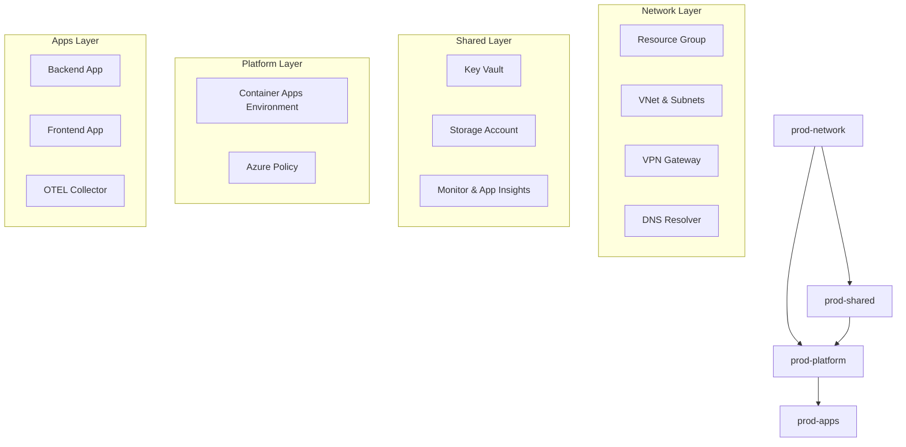

# Terraform Layered Deployment Guide

## Overview

The FleetPulse infrastructure has been refactored from a single monolithic Terraform root module into four independent layers. This approach provides better security, maintainability, and deployment control.

## Architecture

### Layer Structure

```
infra/terraform/envs/
├── prod-network/     # Network Foundation
├── prod-shared/      # Shared Services  
├── prod-platform/    # Platform Services
└── prod-apps/        # Applications
```

### Dependencies



## Deployment Order

**IMPORTANT**: Layers must be deployed in this exact order due to dependencies:

1. **prod-network** - Foundation networking and resource group
2. **prod-shared** - Key Vault, Storage, and Monitoring 
3. **prod-platform** - Container Apps Environment and Policy
4. **prod-apps** - Applications and workloads

## Prerequisites

### 1. Remote State Storage

Set up Azure Storage for Terraform remote state:

```bash
# Create resource group for Terraform state
az group create --name rg-terraform-state-prod --location "West Europe"

# Create storage account (globally unique name required)
az storage account create \
  --name stwbtfstateprod \
  --resource-group rg-terraform-state-prod \
  --location "West Europe" \
  --sku Standard_LRS \
  --encryption-services blob

# Create container
az storage container create \
  --name tfstate \
  --account-name stwbtfstateprod
```

Grant the identity that runs Terraform **Storage Blob Data Contributor** (or **Storage Blob Data Owner**) access to the state container so Azure AD authentication can list and read blobs:

```bash
TERRAFORM_PRINCIPAL_OBJECT_ID="$(az ad signed-in-user show --query id -o tsv)"  # or service principal/object ID used in CI/CD
STORAGE_SCOPE="$(az storage account show \
    --name stwbtfstateprod \
    --resource-group rg-terraform-state-prod \
    --query id -o tsv)"

az role assignment create \
    --assignee-object-id "$TERRAFORM_PRINCIPAL_OBJECT_ID" \
    --assignee-principal-type User \
    --role "Storage Blob Data Contributor" \
    --scope "$STORAGE_SCOPE/blobServices/default/containers/tfstate"
```

If the identity is a service principal or managed identity, adjust `--assignee-principal-type` accordingly. Without this role assignment, Terraform init will fail with `AuthorizationPermissionMismatch` (HTTP 403) when it tries to enumerate the state blobs.

### 2. Configure Authentication

Ensure you have appropriate Azure credentials configured:

```bash
# Login to Azure
az login

# Set subscription if needed
az account set --subscription "your-subscription-id"

# Verify permissions
az account show
```

## Deployment Steps

### Layer 1: Network Infrastructure

```bash
cd infra/terraform/envs/prod-network

# Copy and configure variables
cp terraform.tfvars.example terraform.tfvars
cp backend.conf.example backend.conf

# Edit terraform.tfvars with your values:
# - on_premises_gateway_ip: Your actual OPNsense public IP
# - on_premises_networks: Your on-premises network CIDRs
# - vpn_shared_key: Actual pre-shared key

# Edit backend.conf with your storage account details

# Initialize and deploy
terraform init -backend-config=backend.conf
terraform plan
terraform apply
```

### Layer 2: Shared Services

```bash
cd ../prod-shared

# Copy and configure variables
cp terraform.tfvars.example terraform.tfvars
cp backend.conf.example backend.conf

# Edit backend.conf with your storage account details
# terraform.tfvars should match your backend configuration

# Initialize and deploy
terraform init -backend-config=backend.conf
terraform plan
terraform apply
```

### Layer 3: Platform Services

```bash
cd ../prod-platform

# Copy and configure variables
cp terraform.tfvars.example terraform.tfvars
cp backend.conf.example backend.conf

# Edit terraform.tfvars with your custom domains
# Edit backend.conf with your storage account details

# Initialize and deploy
terraform init -backend-config=backend.conf
terraform plan
terraform apply
```

### Layer 4: Applications

```bash
cd ../prod-apps

# Copy and configure variables
cp terraform.tfvars.example terraform.tfvars
cp backend.conf.example backend.conf

# Edit terraform.tfvars with:
# - container_images: Your actual container image versions
# - custom_domains: Your custom domains
# - home_cidrs: Your home network CIDRs for access restrictions

# Initialize and deploy
terraform init -backend-config=backend.conf
terraform plan
terraform apply
```

## Key Outputs Per Layer

### Network Layer Outputs
- `vnet_id` - Used by shared and platform layers
- `aca_subnet_id` - Used by platform layer
- `privatelink_subnet_id` - Used by shared layer
- `dns_resolver_inbound_ip` - For on-premises DNS configuration

### Shared Layer Outputs
- `key_vault_id` - Used by apps layer
- `log_analytics_workspace_id` - Used by platform layer
- `application_insights_connection_string` - Used by apps layer

### Platform Layer Outputs
- `container_app_environment_id` - Used by apps layer
- `default_domain` - Used by apps layer
- `static_ip` - For DNS configuration

### Apps Layer Outputs
- `dns_configuration` - Complete DNS setup information
- `resource_ids` - For CI/CD pipeline integration

## Migration from Monolithic Structure

If migrating from the existing monolithic prod environment, use the import strategy:

### Step 1: Backup Current State
```bash
cd infra/terraform/envs/prod
cp terraform.tfstate terraform.tfstate.backup
```

### Step 2: Import Resources Layer by Layer

**Network Layer Import:**
```bash
cd ../prod-network
terraform init -backend-config=backend.conf

# Import resources (example commands)
terraform import azurerm_resource_group.main /subscriptions/{subscription}/resourceGroups/rg-fleetpulse-prod
terraform import module.vnet.azurerm_virtual_network.main /subscriptions/{subscription}/resourceGroups/rg-fleetpulse-prod/providers/Microsoft.Network/virtualNetworks/vnet-fleetpulse-prod
# ... continue for all network resources

# Verify no changes needed
terraform plan
```

**Continue for each layer in order...**

### Step 3: Remove from Original
Only after successful import and zero-diff plans:
```bash
cd ../prod
# Remove imported resource blocks from main.tf
terraform plan  # Should show only deletions
# Don't apply yet - verify everything works first
```

## Validation

After each layer deployment, verify:

1. **State file created**: Check Azure Storage container for the layer's `.tfstate` file
2. **Resources deployed**: Verify resources exist in Azure Portal
3. **Outputs available**: Run `terraform output` to see exported values
4. **Next layer can plan**: Attempt `terraform plan` on dependent layers

## Troubleshooting

### Remote State Issues
- Verify storage account exists and is accessible
- Check `backend.conf` values match actual resources
- Ensure proper Azure credentials and permissions

### Import Issues
- Use `terraform import -help` for correct syntax
- Check resource IDs with `az resource list` commands
- Verify resource names match between layers

### Dependency Issues
- Ensure layers deployed in correct order
- Check remote state data sources are properly configured
- Verify output values are correct type and available

## Best Practices

1. **Always use remote state** - Never use local state for production
2. **Version lock providers** - Pin provider versions in each layer
3. **Use consistent naming** - Follow established naming conventions
4. **Tag everything** - Apply consistent tags across all layers
5. **Plan before apply** - Always review plans before applying
6. **Backup state** - Keep backups of state files before major changes

## Security Considerations

- Store sensitive values (VPN keys, etc.) in Azure Key Vault, not in `.tfvars` files
- Use Azure AD authentication for backend storage
- Implement RBAC on Terraform state storage
- Consider using separate storage accounts per environment
- Rotate access keys regularly

## Next Steps

1. **CI/CD Integration**: Update deployment pipelines to use layered structure
2. **Monitoring**: Set up monitoring for each layer's resources
3. **Documentation**: Update operational runbooks for new structure
4. **Testing**: Implement automated testing for each layer